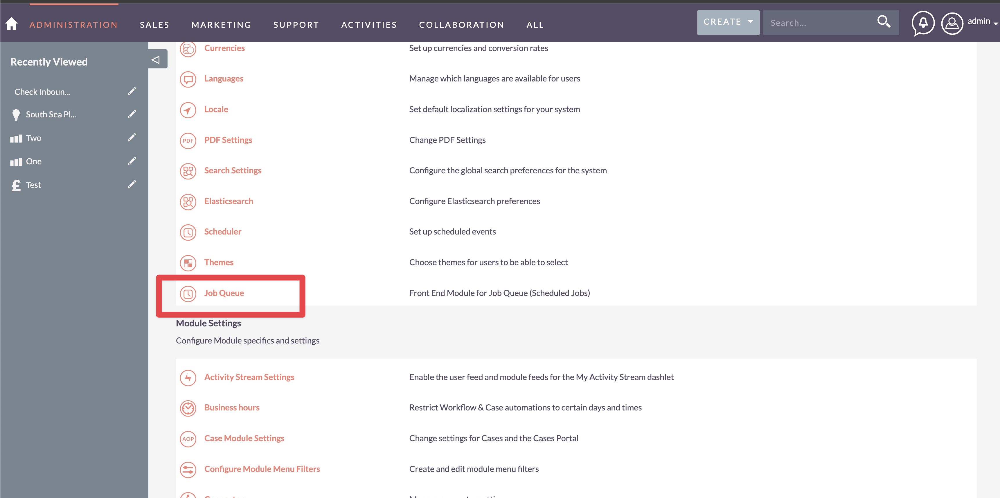
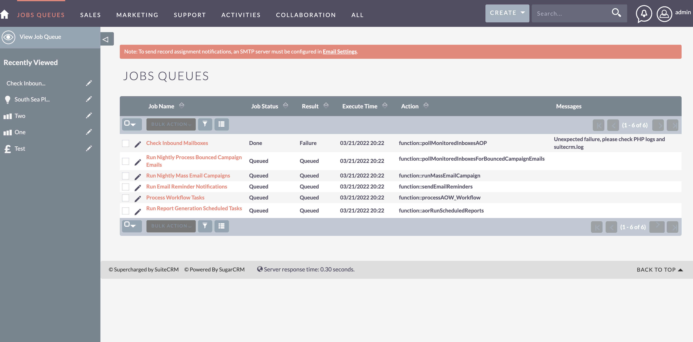
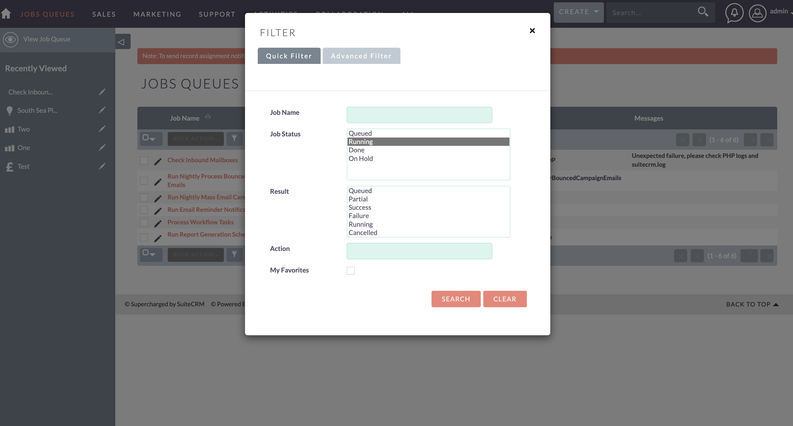

# Job Queue

This module gives the job_queue table a nice Sugar Front End.
With this front end you can re-run jobs, cancel jobs and
just generally monitor scheduled jobs.

The goal of this module is to not necessarily to update or edit the Job Queue but for admin visibility in the front end.

> Note: This package creates a module called job_queue which is the same name as the 
> database table job_queue. This is an existing table defined in the ScheduledJobs vardefs. 
> Be careful in attempting to write any logic hooks or workflows based on the job_queue module.
> It is easy to conflict with the ScheduleJobs bean and cause failures. 

This project is based on the efforts of Ken Brill to expose the job_queue table and scheduled jobs
for SugarCRM but adapted as a installable package for SuiteCRM.

[Job Queue For Sugarcrm by Ken Brill](https://github.com/kenbrill/job_queue)

You will find the job_queue tool on your admin menu in the
'System' section

Once you click on that link you will be taken to the job_queue 
module.  There is no tab for this module so normal users 
will not have access to it.  This module shows you all
the relevant information about your scheduled jobs.

You can search for 'Running' jobs, 'Failed' jobs or as we do most of the 
time, 'Running AND Queued' jobs so we can just monitor its
progress when thats needed.

